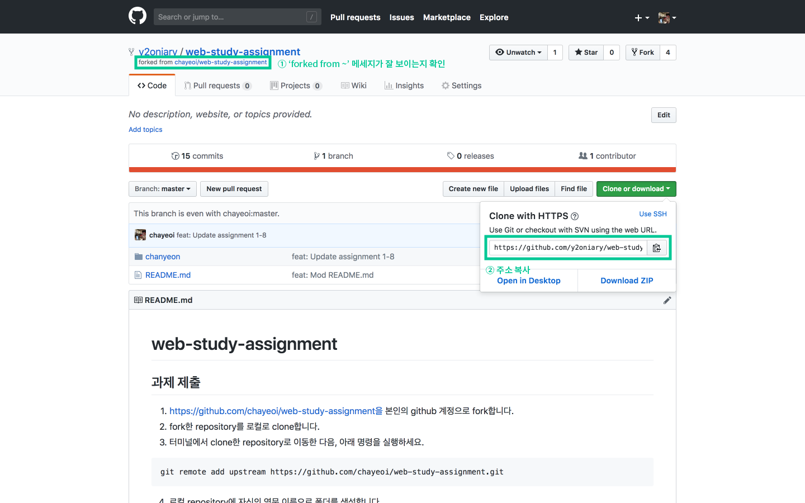
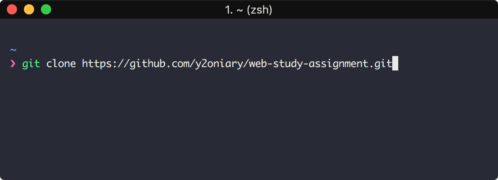
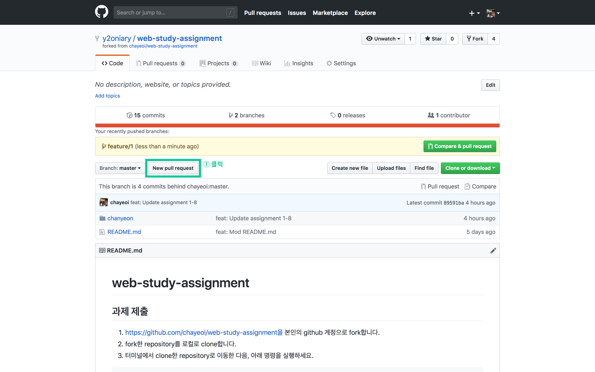
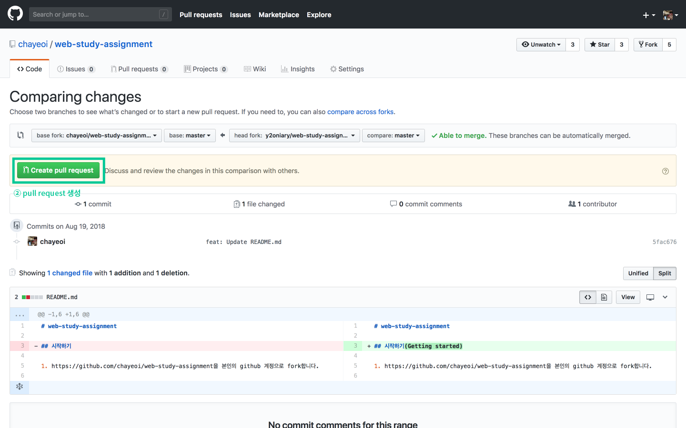
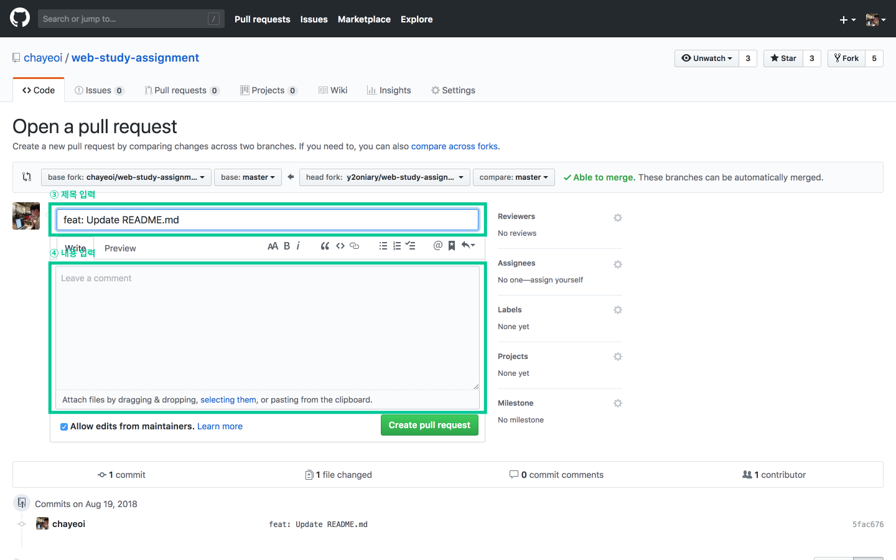
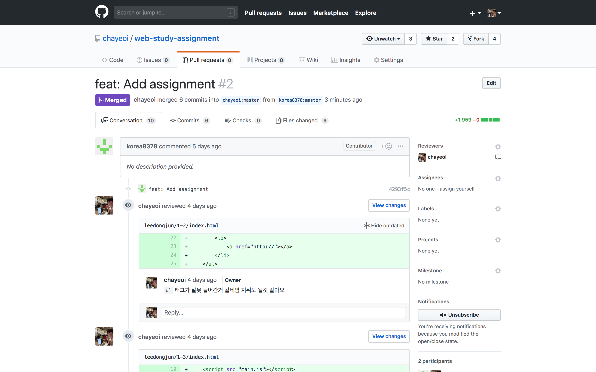

# web-study-assignment

## 시작하기

1. https://github.com/chayeoi/web-study-assignment을 본인의 github 계정으로 fork합니다.


2. fork한 원격 repository의 URL을 복사합니다.(주의: 원본(중앙 원격) repository가 아닌 방금 fork한 원격 repository의 URL을 복사해야 합니다!)



3. 터미널을 실행한 후, 방금 복사한 URL을 붙여넣어 로컬로 clone합니다.

```bash
git clone [복사한 URL]
```



4. 터미널에서 clone한 repository로 이동한 후, [원본 repository](https://github.com/chayeoi/web-study-assignment)를 upstream이라는 별칭으로 추가합니다.

```bash
cd web-study-assignment
git remote add upstream https://github.com/chayeoi/web-study-assignment.git
```

## 과제 제출하기

1. 자신의 영문 이름으로 폴더를 생성합니다. 그 안에 미션 단위로 폴더를 만들어 과제를 업로드합니다. 이때 각 과제 파일명은 index.html로 만들어주세요.

```plain
chanyeon/
  1-2/
    index.html
  1-3/
    index.html
  1-4/
    index.html
  1-5/
    index.html
  1-6/
    index.html
```

3. add, commit한 다음, fork한 repository(origin)로 push합니다.

```bash
git add .
git commit -m "feat: Add assignment 1-3"
git push origin master
```

4. 브라우저에서 fork한 원격 repository로 접속 후 원본 repository에 대한 pull request를 생성합니다.







## 코드 리뷰 진행 및 반영하기

1. 원본 repository의 `pull request` 패널에서 코드 리뷰를 진행합니다.



2. 수정 요구 사항이 있다면 반영한 후 add, commit, push합니다. 만약 이전에 요청한 pull request가 아직 닫히지 않았다면, push까지만 진행하는 것으로도 변경 사항이 이전 pull request에 즉시 반영됩니다.

## 내 로컬 repository를 중앙 원격 repository(upstream)와 동기화하기

1. 터미널에서 다음 명령을 실행하면 로컬 repository의 master 브랜치를 중앙 원격 repository(upstream)의 master 브랜치와 동기화할 수 있습니다.

```bash
git pull upstream master
```

## 벌금 현황

|            |  김찬연  |  이동준  |  강주영  |  고은이  |  이윤희  |  김범준  |  이다민  |
| ---------- |  ----  |  ----  |  ----  |  ----  |  ----  |  ----  |  ----  |
| 2018-08-19 |        |  3500  |  3500  |        |        |  3500  |        |
| 2018-08-26 |        |        |  1000  |  2000  |        | 10000  |        |
| 2018-09-02 |        |        |        |        |        |        |        |
| 2018-09-09 |        |        |        |        |        |        |        |
| 2018-09-16 |        |        |        |        |        |        |        |
| 2018-09-23 |        |        |        |        |        |        |        |
| 2018-09-30 |        |        |        |        |        |        |        |
| 2018-10-07 |        |        |        |        |        |        |        |
| 2018-10-14 |        |        |        |        |        |        |        |